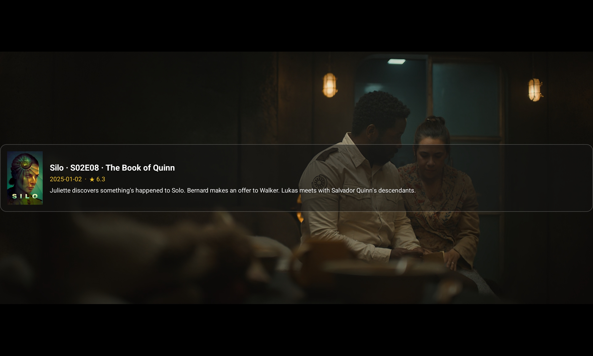
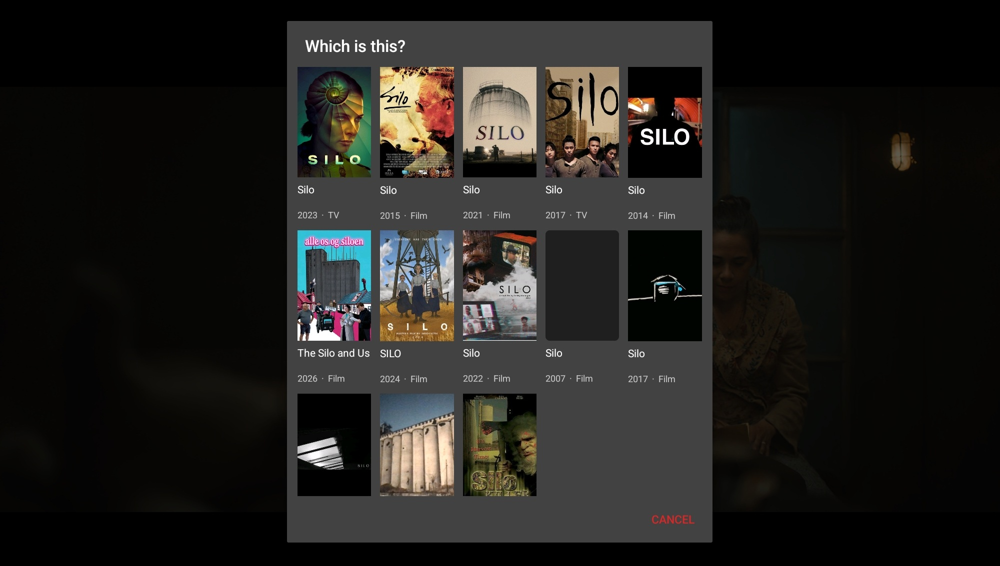
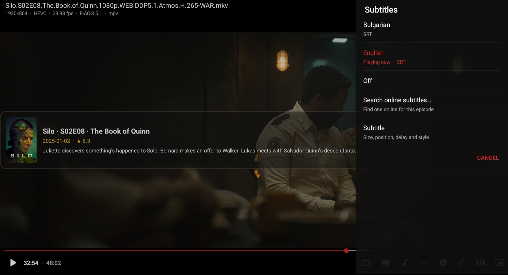
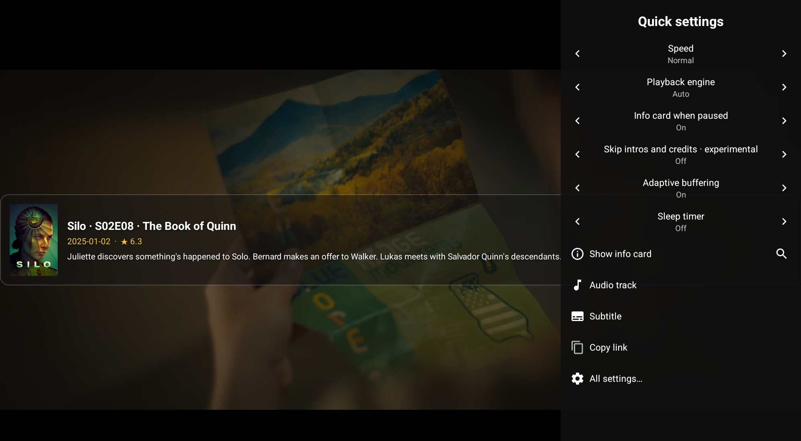
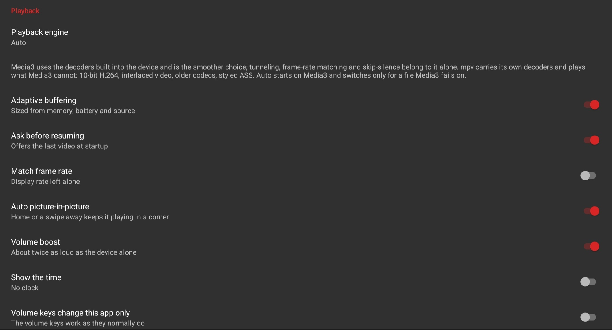
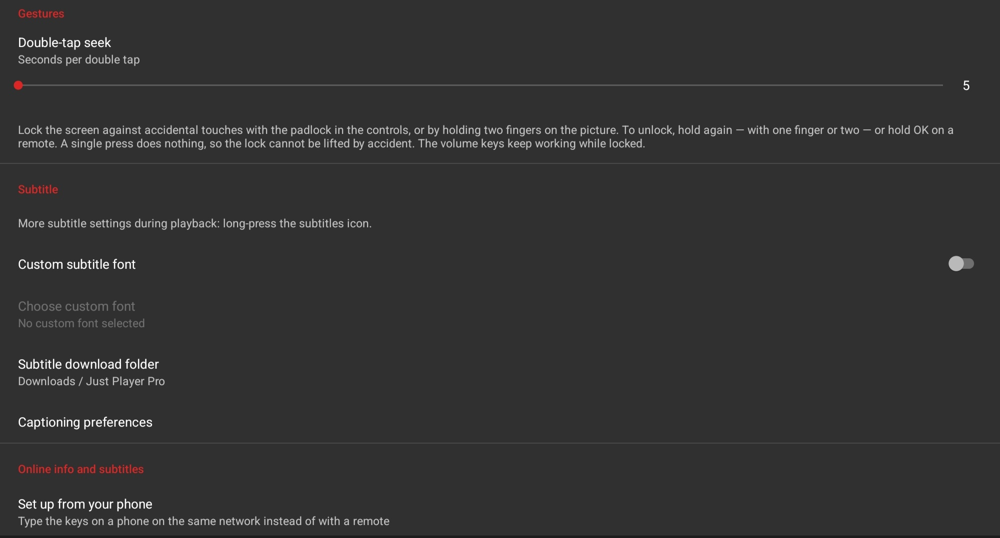
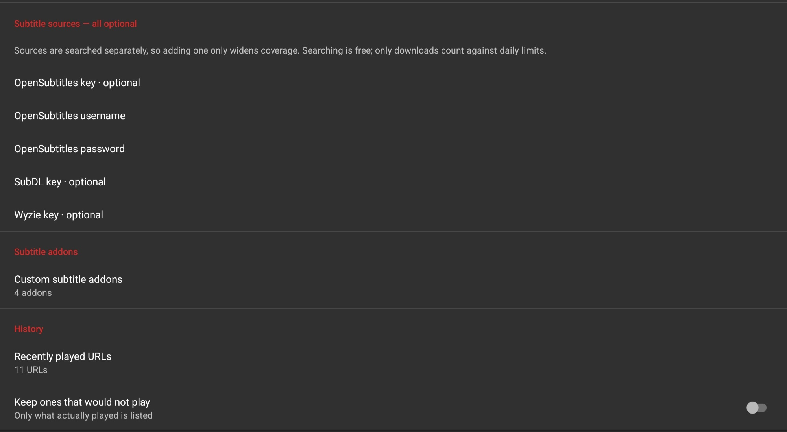
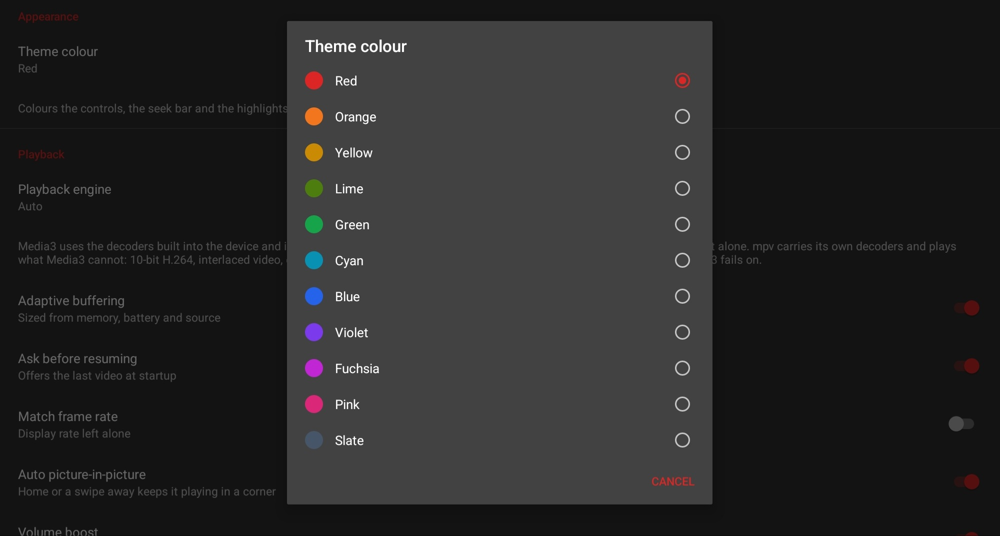
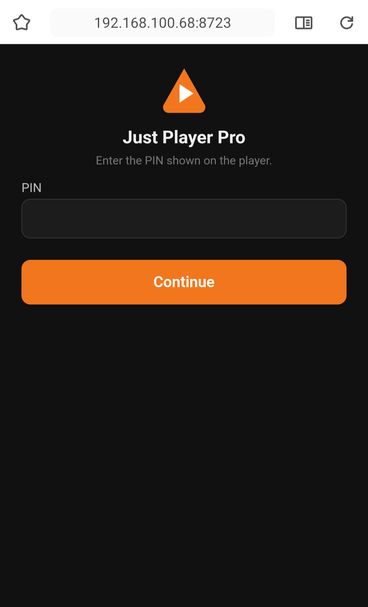

<div align="center">


# Just Player Pro

### Two engines · Two platforms · It plays anything you throw at it

Media3/ExoPlayer and a full build of mpv ship inside one app, and the player moves between them on
its own — so a file one cannot decode is handled by the other instead of failing. The same build is
driven by a finger on a phone or by a D-pad from across the room, and behaves the same either way.

[](https://github.com/Zain-Imam/just-player-pro/releases/latest)
[](#building)
[](#the-two-engines)
[](#two-platforms)
[](#about-the-claim)
[](LICENSE)



</div>

---

Built on [Just Player](https://github.com/moneytoo/Player) by Marcel Dopita, whose strengths are
kept intact: no ads, no tracking, barely any permissions, and playback that hands the bitstream
straight to the device's decoders.

It installs as a separate app (`app.justplayerpro.android`), so it can sit alongside any other
player you already use.

> Built from real use rather than from a roadmap: things land when they are worth shipping, and
> each one is tested on a device before it is released. There is no support desk behind it — issues
> and pull requests are read, and nothing is promised beyond that.

## Download

Grab the newest build from **[Releases](https://github.com/Zain-Imam/just-player-pro/releases/latest)**.

| File | For |
|---|---|
| `just-player-pro-3.0.0-arm64-v8a.apk` | Almost every phone, tablet and TV box made since 2017 |
| `just-player-pro-3.0.0-armeabi-v7a.apk` | Older 32-bit devices |
| `just-player-pro-3.0.0-x86_64.apk` · `-x86.apk` | Emulators and the few x86 devices |
| `just-player-pro-3.0.0-universal.apk` | All four at once — four times the mpv payload, so only if you are unsure |

Android 7.1 or newer. The mpv engine additionally needs Android 8.0 and is offered only there.

### New in 3.0

Everything here works on **both engines** and under **both input methods**, which is the bar each
one had to clear before it shipped:

| | |
|---|---|
| **Audio delay** | ±5 s either way, per file, with an accelerating hold |
| **Subtitle delay, live** | applied to the running player — no re-buffer, no stall, and it is in the quick panel too |
| **Speed per file** | a file reopens at the speed it was last watched at |
| **Keep playing the sound** | screen off, or the player put away, and the sound carries on *(off by default)* |
| **Preview while seeking** | the frame you are dragging towards, for files on the device |
| **Demanding-file warning** | measured against the device's own decoders before it stalls |
| **Network speed** | on the top line, for streams, counted from the bytes that arrive |
| **Export and import** | settings, keys, history and per-file memory, in one file |
| **Subtitles from storage** | and any number of folders the player may read |
| **Settings without a restart** | the film is held at the frame it was on; only what must reopen, reopens |

---

## The two engines

| | Media3 / ExoPlayer | mpv |
|---|---|---|
| Decoding | the device's own hardware decoders | the device's where it has one, its own 501 where it does not |
| Best at | smoothness, battery, TV boxes | anything the device has no decoder for |
| Version here | 1.10.0 (patched aars — see [Building](#media3-is-pinned-to-the-aars-and-cannot-be-raised-on-its-own)) | 0.41.0 with FFmpeg n8.1 |

Both engines reach for the chip first. mpv asks for the zero-copy path before the copying one, which
on a 1080p film is the difference between about 1.5 processor cores and about 0.95 — measured, on
the same file, over the same seven minutes. Media3 is still the lighter of the two, at about 0.8,
because it never touches the frame at all.

**Media3** is the default. It hands the bitstream straight to the device's decoders and renders
zero-copy onto a `SurfaceView`, which is why it plays smoothly on TV boxes where GPU-rendering
players stutter, and why it is the one that does tunneled playback and display frame-rate matching.
It is also the one that handles adaptive streams properly, choosing a rendition to suit the device.

**mpv** carries its own decoders — **501 of them** — so it does not care what the device supports.
10-bit and 4:2:2 H.264, interlaced video, VC-1, RealVideo, Cinepak, Indeo, ProRes, DNxHD, FFV1,
HuffYUV, styled ASS subtitles, DTS, TrueHD, Musepack, APE, ATRAC3, QDM2 — all of it decodes in
software on any device. It streams over https like anything else, having been given the device's own
certificates, without which it could not open a TLS address at all.

**Auto** (the recommended setting) starts every file on Media3 and switches to mpv only when Media3
reports it cannot play the video. Nothing is tried twice, and the switch keeps your position. Pick
one by hand instead and it stays picked — and if that engine cannot play something, the player
offers you the other one rather than just failing.

Live streams work on both: HLS live, HLS on demand and DASH all play, on either engine and on Auto.

### About the claim

"Plays anything" is a large thing to say, so here is exactly what backs it:

* The bundled mpv reports **501 decoders** and essentially the whole FFmpeg demuxer set — the same
  library VLC and mpv on the desktop use. This is not a cut-down build.
* The only two codecs checked for and *not* found in mpv are **AMR-NB and AMR-WB**, the narrowband
  speech codecs — and those are exactly the ones Android's own decoders have always provided, so
  Media3 covers them. The two engines complement each other rather than overlap.
* Container support comes from FFmpeg's demuxers: MKV, MP4, AVI, TS, FLV, OGG, WMV/ASF, RM, VOB,
  M2TS, WebM, and the long tail of formats nobody has opened since 2004.

The honest exception: **DRM-protected streams** (Widevine and friends) are not supported by either
engine here, and nothing in this app tries to work around that.

---

## Two platforms

One build, driven either way, behaving the same both ways. Nothing is switched on by asking what
kind of device this is — only by what you actually press.

| | Phone and tablet | Television and set-top box |
|---|---|---|
| Show the controls | Tap the picture | Up or Down |
| Seek | Drag across, or double tap a third of the screen | Left and Right; on the timeline the step grows as you hold |
| Volume and brightness | Drag up or down, left half or right | The device's own keys, past 100% for the boost |
| Pick a track or a setting | Tap a row | Arrows and OK — every panel takes the focus as it opens |
| Zoom the picture | Pinch, or hold the frame button | Hold the frame button, then the arrows |
| Lock the screen | Hold two fingers on the picture | Hold OK |

Layouts are in dp and sp throughout and reflow rather than clip, so portrait, landscape, tablets and
televisions all get the same build. The detail — and what a television genuinely cannot do — is in
[Televisions and remotes](#televisions-and-remotes).

---

## Knowing what you are watching

<div align="center">
  
</div>

A release filename goes to TMDB and comes back as a title, year, rating, poster and synopsis. When
the guess is wrong — and with a name like `Silo` it will be — the **search button on the info card
row** asks again, and what you choose there is what sticks, for that file, from then on.

* **Titles pulled out of links, not just filenames.** Query strings and tokens are dropped, the last
  segment that looks like a name rather than an id is taken, percent-encoding is undone (twice,
  where a name has been through two services), and what is left is parsed: brackets, checksums,
  release groups, resolutions, codecs and sources come out, `S01E02`, `1x02`, `EP1089`,
  `Episode 12`, `Season 3` and the anime `Title - 08` form all go in. Whatever the launching app
  called it wins over the address.
* **Info card while paused** — poster, title, season/episode, date, rating and synopsis, centred on
  the picture and sized to it, so on a letterboxed film it stops where the picture stops. It hides
  itself during seeking, menus, dialogs, PiP and lock, and the centre controls step aside into the
  time row while it is up. **How solid it sits over the picture is a slider**, from invisible to
  opaque.
* **One title, or two.** The card and the subtitle search normally share a title, so correcting
  either corrects both. Turn that off and they are independent — the card can show one film while
  subtitles are searched for another.
* **Identity survives regenerated links** — debrid URLs expire, so a file is remembered by path and
  filename as well as URL. Re-opening the same film through a fresh link keeps its identity, its
  subtitles and its skip markers.
* **A film handed over while the player is still open is the film described.** Another app sending a
  second video to a player already in memory used to leave the title, poster, synopsis and markers
  of the one before it on screen. Both ways in now do the same work.
* **History with real titles** — the recently-played list and the "Play last video?" prompt show
  the film's name, not a UUID from the URL.

---

## Subtitles

<div align="center">
  
</div>

* **Online search and download** from OpenSubtitles, SubDL and Wyzie, with the language you set.
* **Open one you already have** — a row in the subtitle picker opens the file picker, so a subtitle
  sitting on the device is two taps away rather than hidden behind a long press.
* **Any number of folders** — the player can be given several places to read from, so a library
  split across internal storage and a card is searched in both for the next episode or a subtitle
  beside the film. Granting a second folder no longer silently replaces the first.
* **A delay that moves as fast as you need it to** — holding the arrow accelerates, so ten seconds
  is about a second and a half of holding rather than a hundred presses.
* **Adjusting it never reopens the file.** The delay is applied to the running player on both
  engines, so nothing re-buffers, nothing stalls, and the number follows the arrow as it is pressed.
  It sits in the subtitle panel and in the quick panel, beside the audio delay.
* **Custom Stremio subtitle addons** — up to five, each verified against a known film before it is
  saved, so a broken addon is caught when you add it and not when you need it. Addon 1 comes
  pre-filled with the official OpenSubtitles addon and works as-is.
* **It asks which film before it searches** when automatic search is off — because turning that off
  means *do not go looking without me*, and the answer it guessed as the file opened is not always
  the one you want subtitles for. **Search again…** sits at the top of the results, too, for when
  the list is plainly for the wrong film.
* **Downloads never restart playback** — the subtitle is attached in place, your position is kept,
  and the new track is selected automatically.
* **Named by release, not by file** — a downloaded subtitle appears under the provider's release
  name rather than the filename it happened to be saved as.
* **It says so when one will not load.** A subtitle that fails is reported instead of the picker
  quietly claiming it is playing.
* **A subtitle button that is always available** — it no longer greys out when a file has no
  subtitle tracks; it offers to search online instead.
* **Position works on both engines, and stays on the picture.** The slider used to do nothing at
  all on Media3 for a subtitle carrying its own placement — every ASS file and a good many converted
  SRTs — and on mpv it pushed the text off the edge of the frame, where it was clipped away rather
  than moved. Both now place the line inside the picture and never in the letterbox, and a cue the
  file deliberately put at the top is left there.
* **Styling works on both engines** — size, position, edge style and typeface are translated into
  mpv's own vocabulary (`sub-pos`, `sub-scale`, `sub-ass-override`…) so the sliders mean the same
  thing whichever engine is playing, including below the default position.
* **Subtitles handed over by another app are kept.** Stremio, Nuvio and the rest each pass them in a
  slightly different shape — an array of Uri, a list of Uri, an array of plain strings, a list of
  strings, or one on its own — and all of them are read, along with the several spellings of the
  name and language keys. The one the launcher asked to have on is switched on, under both engines,
  and carries its name and language into the picker.
* **A language order rather than a single language** — `jpn, eng, spa`, and the first one the file
  actually has is the one that opens. There is one for audio and one for subtitles, and both engines
  read the same list.

### Skipping intros and credits

* **Chapters first, databases second.** If the file has chapters naming an intro or the credits,
  those are used — read from mpv directly, and parsed out of the Matroska container for Media3,
  which has no chapter API of its own. Otherwise the online markers are used.
* **Sources merged, not stacked** — markers from chapters, IntroDB, TheIntroDB, SkipDB and AniSkip
  are clustered by overlap; the most corroborated cluster wins, and ties break by source
  reliability. Precise bounds beat placeholder ones.
* A **Skip intro / Skip credits** button appears only while a marker is live. It takes focus, so OK
  on a remote presses it, and it offers to **undo** the skip for three seconds afterwards.

---

## Everything to hand

<div align="center">
  
</div>

One tap of the gear brings the quick panel in along the edge: speed, audio delay, subtitle delay,
engine, info card, skip markers, buffering, sleep timer, the track pickers, the film's address on
the clipboard, and a way into the full settings screen. The rows you change with arrows sit
together, above the rows you press. The audio button has a panel of its own too, so the sound's
delay is where somebody adjusting the sound would look for it. Panels come in **along the trailing edge at full height**, all the
same width, barely dimming the film — because what is being chosen is almost always a decision about
what is on screen at that moment.

* **Tracks described properly.** Resolution, channel layout, codec, sample rate, bit rate, and
  whether a track is forced, for the hard of hearing, or an audio description — in one fixed order,
  identically on both engines, so two English soundtracks are never two identical rows.
* **A second line under the title** saying what is actually playing: `1920×804 · HEVC · 23.98 fps ·
  E-AC-3 5.1 · mpv · 2.1 MB/s`, built from the tracks the player settled on rather than from the
  file, ending with the engine — which on Auto is the only way to know which one a file landed on —
  and, for a stream, how fast it is arriving. The speed is counted from the bytes that actually
  come in rather than from a bandwidth estimate, and a file on the device is given none.
* **Video track picker** — a stream served as a ladder of bitrates, or a file carrying more than one
  video track, gets a list with Auto at the top.
* **Ten scaling modes, each with its own icon** — Default, Crop, Stretch, then 16:9, 4:3, 16:10,
  2:1, 2.35:1, 2.39:1 and 5:4, stepped through from the frame button with free zoom on a long press.
  Default is the film's own shape; a ratio you force belongs to that film and does not follow you to
  the next one.
* **Landscape, portrait or auto-rotate** — three plain choices, not a description of how the player
  decides.
* **Errors in words**, with the details behind a button — shareable, or shown as a code a phone can
  scan when there is nothing on the device to share to.

### Playback

<div align="center">
  
</div>

* **Adaptive buffering** — the same device-aware profiles applied to *both* engines, so they buffer
  alike. The profile is picked from device memory, battery level and whether the source is a live
  stream: `device-low` (30s/120s), `device-balanced` (50s/300s), `device-high` (60s/600s) or
  `live-stream` (5s/15s). Back buffer is held at 25% of the forward buffer at every tier.
* **Audio delay** — ±5 seconds either way, per file, on both engines. mpv has the property; Media3
  has no such thing, so the delay is applied to the clock the audio renderer reports, which is what
  the picture follows. Holding an arrow accelerates, and the number is remembered against the file.
* **Playback speed per file** — a documentary watched at 1.25× opens at 1.25× next time, however
  many films at normal speed came in between. The last speed chosen is still what an unwatched file
  opens at.
* **Keep playing the sound** *(off by default)* — the screen can go off, or the player be put away,
  and the sound carries on. Picture-in-picture still wins on Home when it is enabled.
* **Preview while seeking** *(on by default)* — dragging the bar shows the frame you are heading
  for, decoded from the file itself. Local files only: doing it over a connection would mean
  fetching the film twice.
* **A warning before a file stalls the device** — the decoders are measured against what is about to
  play, and a file beyond them offers *play anyway*, *try the other engine* where the other engine
  has a real chance, or *close*. Once per file, with a *do not warn me again*.
* **Volume boost** — up to 150%, applied through a `LoudnessEnhancer` on Media3 and mpv's own
  volume on mpv. No restart, and the scale stays 0–100 either way.
* **Picture-in-picture on Home** — pressing Home drops the film into PiP instead of pausing it.
* **Double-tap seek step** is configurable, and the arrows on a remote use the same setting rather
  than a fixed ten seconds.
* **Hold the picture for double speed**, let go to drop back.
* **Sleep timer** — a set number of minutes or at the end of the file, fading the sound out over the
  last thirty seconds rather than cutting it.
* **Ask before resuming** — the last file is offered rather than started, and declining keeps it
  remembered.
* **A clock on screen** while the controls are up, **keep screen on** while playing, and **volume
  keys that change the film rather than the ringtone** when that is what you want.
* **Check for updates** — an entry in settings that asks the releases page whether there is a newer
  build and offers to fetch it. Never automatic; nothing reaches the network on its own.

### Settings you can read

<table>
<tr>
<td width="50%"></td>
<td width="50%"></td>
</tr>
</table>

Sectioned and shorter, with every switch saying what it currently does rather than what it is
called. **Test keys and addons** checks every service on demand rather than only as a key is typed
in: one that stopped answering last week still looked fine until the evening it was needed.

* **A green tick against everything already set** — a key is never shown back once entered, so
  without one the screen looks identical whether a key was typed in or never was.
* **Leaving settings does not restart the film.** It is held at the frame it was on for the length
  of the trip, and only the handful decided when a player is built — the engine, the buffering, the
  decoders, tunneling, Dolby Vision mapping — reopen the file. Each of those rows says so.
* **Export and import** — settings, keys and addons, history, and the per-file delays and speeds,
  written to one JSON file through the system file picker. The export asks which parts to include,
  so a file can be shared without the keys in it; the import takes whatever the file holds. Folder
  permissions cannot travel between devices, and the dialog says so rather than failing quietly.

### Make it yours

<div align="center">
  
</div>

**Eleven accent colours**, orange by default. The chosen colour runs through the controls, the seek
bar and every highlight. The launcher icon stays orange.

* **Rebuilt bottom bar** — play/pause is the leftmost item in the time row, tapping the time
  toggles remaining-versus-total, and the row shares one line with the button strip so nothing
  becomes unreachable in portrait.
* **Tap the timeline to seek there** — anywhere *on* the line, and nothing outside it. The stock bar
  accepted a press anywhere in a 48dp band the height of the whole bottom bar.
* **The buffered band stays visible while you drag.** Media3 discards its buffer on a seek outside
  what it holds, so the white band used to vanish the moment a drag began; it is now held for the
  length of the drag.

### Set up from your phone

<div align="center">
  
</div>

Typing an API key with a remote is miserable, so settings offers a PIN-gated page on your local
network instead. Open the address on a phone, enter the PIN shown on the television, and type the
keys and addon URLs on a real keyboard.

### Inherited from upstream

Nothing was removed. Every setting the projects this builds on shipped is still present and works:
file access mode, preferred audio language, display frame-rate matching, PiP, skip silence, repeat,
custom subtitle fonts, decoder priority, tunneled playback and Dolby Vision profile 7 mapping —
along with the gesture controls, the SAF/MediaStore file handling, the Android TV behaviour and the
subtitle settings reachable by long-pressing the subtitle icon.

Subtitle delay is applied at render time, so negative delays actually move embedded MKV subtitles
earlier rather than just shortening them, in 100 ms steps with a `+` prefix on positive values.

---

## Televisions and remotes

The app is built to be driven entirely with a D-pad, and — as of 2.0 — to behave *identically*
whichever is being used. A pile of things used to be switched on by asking whether the device was a
television, when what they actually depended on was whether a key had been pressed: holding the
frame button to zoom, keys reaching the player at all, back closing the controls, lifting the lock,
whether the settings button was live before a file was open. A phone with a remote plugged into it
answered no to that question and got the wrong behaviour. They are all unconditional now.

What is left of the television test is the handful of things a television genuinely cannot do: it
has no rotation, no day-and-night setting, no document picker, and it reports a headphone unplug
that never happened.

* Every screen it adds — the quick panel, the track pickers, the search results, the poster
  picker, the addon settings — takes focus when it opens and is navigable with arrows, because a
  list that nothing has focused ignores a remote completely.
* **A second button on a row is reachable.** Right from the info-card row lands on its search
  button — which a plain direction search will never do, because that button sits *inside* the
  rectangle of the row that has the focus.
* The skip button is focusable and OK presses it. The info card deliberately is not, so it can never
  swallow a press meant for the controls.
* Dialogs open with a button already focused — the confirming one, except where agreeing by
  accident would delete a file, where Cancel has focus instead.
* Settings that belong to one engine are disabled, and say so, rather than silently doing nothing.
* The lock can be lifted by a key or by a long press on the picture, on any device. While locked,
  the volume keys still work: a lock is there to stop a pocket changing the film, and a pocket does
  not press volume buttons.
* Where a value could have been hard-coded for one input method it is not. The arrows seek by the
  step set in settings, the same step the double tap uses.

Layouts are in dp and sp throughout and reflow rather than clip, so the same build is used on
phones in either orientation, on tablets, and on televisions.

---

## Settings that belong to one engine

Most things work identically on both. These four are Media3's alone, and the settings screen
disables them and says so when mpv is selected:

* Tunneled playback
* Display frame-rate matching
* Skip silence
* Dolby Vision profile 7 → HEVC mapping

Custom subtitle *fonts* are also Media3-only; mpv uses its own font handling. The system equalizer
hook is Media3-only too, because mpv opens its own audio output and exposes no session to attach to.

Everything else — decoder priority, subtitle size, position, edge style, typeface and embedded
styles, volume boost, PiP, gestures, chapters, skip markers, online subtitles — works on both.

---

## Using it

### On the picture

| Gesture | What it does |
|---|---|
| Tap | Show or hide the controls |
| Double tap, left or right third | Jump back or forward. The step is yours to set in Settings |
| Double tap, middle | Play or pause |
| Drag up and down, **left** half | Brightness |
| Drag up and down, **right** half | Volume — keep going past 100% for the boost |
| Drag left and right | Scrub through the film |
| Long press | Hold for double speed; let go to drop back. While locked, it unlocks |
| Long press, **two fingers** | Lock the controls. Hold again, with either hand, to unlock |
| Pinch | Zoom the picture |

### On the controls

| Control | What it does |
|---|---|
| Play/pause, far left of the clock | Play or pause |
| The clock | Tap it to swap between time remaining and total running time |
| The timeline | Tap anywhere **on the line** to seek there; drag the circle to scrub |
| Subtitle button | Pick a track, or search online for one |
| Subtitle button, long press | Subtitle size, position, delay, edge and typeface |
| Audio button | Pick a soundtrack, on files with more than one |
| Frame button | Step through the ten scaling modes: Default, Crop, Stretch, 16:9, 4:3, 16:10, 2:1, 2.35:1, 2.39:1, 5:4 |
| Frame button, long press | Free zoom — arrows or a pinch resize the picture |
| Rotate button | Landscape, portrait or auto-rotate |
| Gear, one tap | Quick panel: speed, engine, info card, skip markers, buffering, sleep timer, tracks, copy link |
| Gear, long press | The full settings screen |
| Padlock | Lock the controls against accidental touches |
| Folder | Open another file |

### With a remote

| Button | What it does |
|---|---|
| Up / Down | Show and hide the controls |
| Left / Right, controls hidden | Jump back and forward by the step set in Settings — the same one the double tap uses |
| Left / Right, **on the timeline** | Drag the scrubber. A press is one second; hold it and the step grows, so you can cross a film and still stop on the second you want |
| Left / Right, **on a row with a second button** | Move onto that button, and back off it |
| OK, on the timeline | Play or pause |
| OK, on a button | Press it |
| Back | Hide the controls; again to leave |
| Back or OK, while locked | Unlock |
| Volume, while locked | Still changes the volume: the lock is for pockets, not for buttons |

The Skip intro and Skip credits buttons take focus while they are on screen, so OK skips without
hunting for them.

Every one of these works the same on a phone with a keyboard or a remote plugged into it as it does
on a television, and every gesture works the same on a television with a touchscreen. Nothing is
switched on by asking what kind of device it is.

### Setting up the online features

Everything online hangs off **TMDB**, which turns a file name into a title the subtitle and skip
databases understand. The key is free: themoviedb.org → Settings → API. Paste it into
**Settings → Online** and it is checked before it is kept, so a typo is caught there rather than
looking like an empty search later. On a first run the player points you at the settings button and
says so.

Subtitles work with no key at all — a Stremio addon comes set up and ready. OpenSubtitles, SubDL and
Wyzie keys are optional and simply add more to choose from. You can add up to five addons of your
own under **Custom subtitle addons**; each is tested against a known film before it is saved.

Two switches worth knowing:

* **Identify files** — automatic by default, which is what fills the info card, the skip markers
  and the titles in history. Set it to *Only when I ask* and nothing reaches the network until you
  say so.
* **Search subtitles automatically** — off by default, so a search only happens when you ask for
  one, and it asks which film first.

---

## Building

```sh
./gradlew :app:assembleLatestUniversalRelease
```

The APK lands in `app/build/outputs/apk/latestUniversal/release/just_player_pro.apk`.

Per-architecture builds, which are roughly half the size because they carry one copy of mpv
instead of four:

```sh
./gradlew :app:assembleLatestUniversalRelease -PabiFilter=arm64-v8a
./gradlew :app:assembleLatestUniversalRelease -PabiFilter=armeabi-v7a
./gradlew :app:assembleLatestUniversalRelease -PabiFilter=x86_64
./gradlew :app:assembleLatestUniversalRelease -PabiFilter=x86
```

Requirements: Android SDK 36, NDK 29, JDK 11+. Minimum supported device is Android 7.1 (API 25);
the mpv engine additionally needs Android 8.0, and is offered only there.

Release builds are signed from `keystore.properties`, which is not in the repository. Without it the
build falls back to the debug key, which is fine for building and testing but produces an APK that
cannot be installed over a released one. Copy `keystore.properties.example` and point it at your own
keystore if you are building your own releases.

### Media3 is pinned to the aars, and cannot be raised on its own

ExoPlayer and the player view do not come from Maven here. They come from
`app/libs/lib-exoplayer-release.aar` and `lib-ui-release.aar`, patched builds — the player calls
`DefaultRenderersFactory.setMapDV7ToHevc()`, `PlayerView.showProgress()` and
`PlayerView.hideControllerImmediately()`, none of which exist upstream. The four decoder extensions
beside them are not published to Maven at all.

Everything else Media3 does come from Maven, at `media3_version` in `app/build.gradle`, and those
modules are compiled against the ExoPlayer of their own version. **So that number and the version
the aars were built from have to match, and nothing enforces it.** Nothing warns, either: they are
separate artefacts, so javac and R8 both accept a call to a method that is not there, and the
program only finds out when it runs the line.

It has already gone wrong once. Raised to 1.11.0 while the aars stayed at 1.10.0, `HlsMediaSource`
called a method added after 1.10.0, and every HLS stream killed the playback thread with
`NoSuchMethodError` — the player opened, showed the title, and sat at 00:00 saying nothing.

To move Media3 up, rebuild all six aars from the matching AndroidX Media tag with the patches
applied, and change `media3_version` with them. `Media3LinkageTest` checks the two agree, reading
every class file and resolving every call between them, and fails the build if they do not.

### Tests

```sh
./gradlew :app:testLatestUniversalDebugUnitTest          # on this machine
./gradlew :app:connectedLatestUniversalDebugAndroidTest  # on a device
```

The device tests exist for the questions a laptop cannot answer: Android's regular-expression engine
rejects patterns desktop Java accepts, and timing behaves differently on a real main-thread handler.
`tools/smoke.sh` drives the shipped APK over adb; what it covers, and what it does not, is written
down in [docs/VERIFICATION.md](docs/VERIFICATION.md).

### Online features need keys

TMDB is required for identification, and everything downstream of it — the info card, skip markers
and subtitle search — depends on that. The key is free. OpenSubtitles, SubDL and Wyzie keys are
optional and only enable those sources. All of them are entered in Settings → Online; none are
compiled into the app.

---

## Thanks

This stands on other people's work, and it would be poor form not to say so.

* **[Just Player](https://github.com/moneytoo/Player)** by Marcel Dopita — the original, and still
  the foundation: the player core, the gesture controls, the file handling and the Android TV
  behaviour all come from here.
* **[just-player-plus](https://github.com/wasky/just-player-plus)** by Michal Wolski — the subtitle
  settings panel, custom subtitle fonts, the Outline & shadow edge style, the Medium typeface, and
  MicroDVD and MPL2 support.
* **[mpvEx](https://github.com/marlboro-advance/mpvEx)** and
  **[mpvRex](https://github.com/sfsakhawat999/mpvRex)** (Apache 2.0) — the decoder fallback order,
  which turned out to be the whole of the difference in battery and heat on the mpv engine here.

Smaller borrowings — a parser's shape, the way one app or another hands subtitles over on an intent
— are credited in [the release notes](RELEASE_NOTES.md) alongside the change they arrived with.

### Libraries and services

* [libmpv](https://github.com/jarnedemeulemeester/libmpv-android) (`dev.jdtech.mpv:libmpv`), MIT —
  the mpv engine, bundling mpv, FFmpeg and libass.
* [AndroidX Media3](https://github.com/androidx/media), Apache 2.0.
* [TapTargetView](https://github.com/KeepSafe/TapTargetView), Apache 2.0 — the two pointers shown on
  a first run.
* [zxing](https://github.com/zxing/zxing) core, Apache 2.0 — the encoder behind the error code, and
  nothing else.
* Skip markers from IntroDB, TheIntroDB, SkipDB and AniSkip. Titles and artwork from TMDB.
  Subtitles from OpenSubtitles, SubDL, Wyzie and any Stremio addon you add.

This product uses the TMDB API but is not endorsed or certified by TMDB.

Released into the public domain under the Unlicense, like Just Player.
